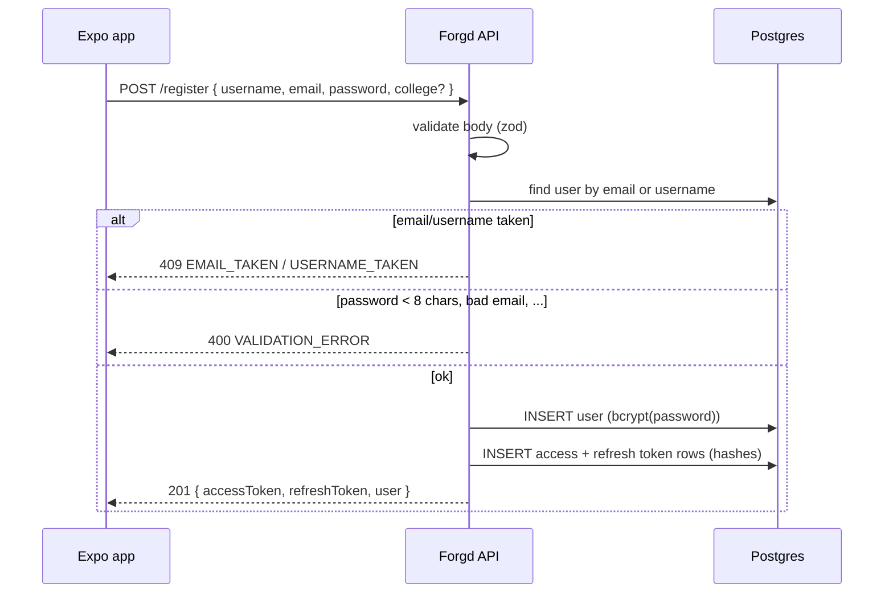
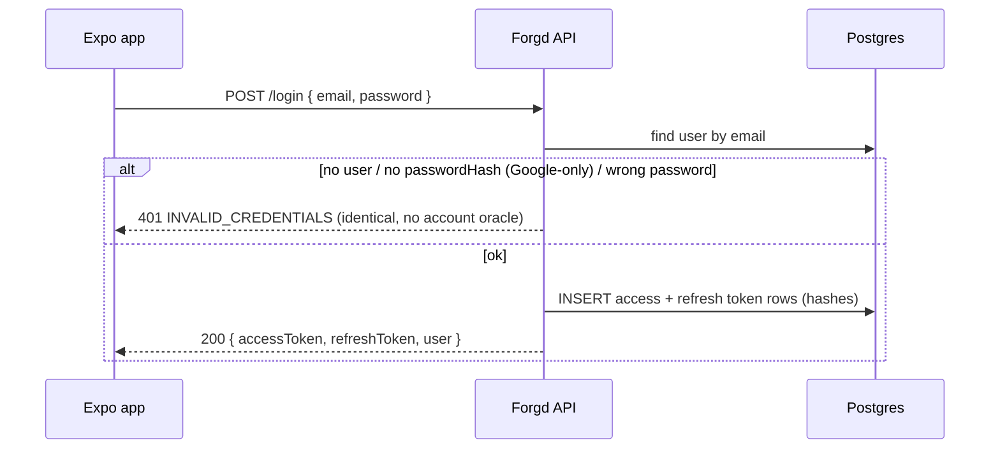
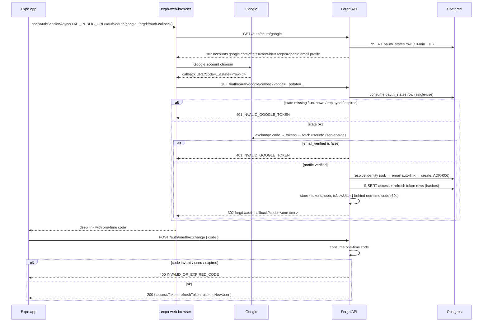
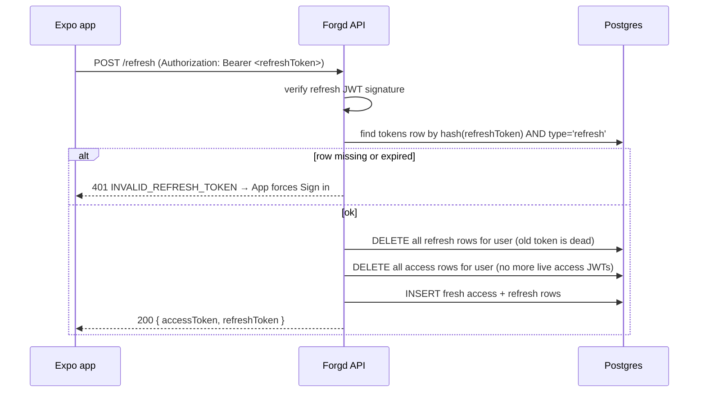
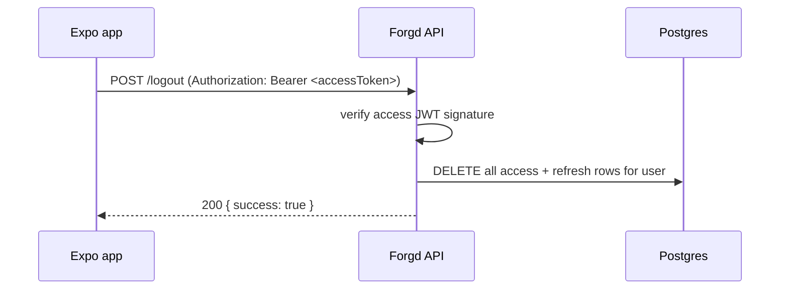

# Auth Flows

Every auth mechanism in the Forgd API, drawn end to end. The API is **sessionless**: all state lives in the database or in short-lived codes, never in cookies (see ADR-002, ADR-007).

All endpoints live under the auth plugin scope: `/register`, `/login`, `/auth/oauth/*`, `/refresh`, `/logout`.

## Token model

- **Access token:** short-lived JWT (15 min, RS256) signed with `reply.jwtSign`, payload `{ sub, jti }`.
- **Refresh token:** JWT (30 days, separate RS256 key pair) signed with `reply.refreshJwtSign`, payload `{ sub, jti }`.
- Both are recorded as SHA-256 hashes in `tokens` (with `type` and `expiresAt`). The row is the revocation record: delete it and the JWT stops being accepted. `jti` makes every token unique so rotation can tell old and new tokens apart (SPEC-04).

## Register

## Login

## Google OAuth (mobile)

The API owns the whole dance with `@fastify/passport` + `passport-google-oauth20` (ADR-007). The OAuth `state` is a row in `oauth_states` (10-min TTL, single-use); the token pair is never in a URL — it is handed over via a 60-second one-time code.

## Refresh (rotation)

## Logout

## Error reference

| HTTP | Code                         | Endpoint                        | When                                                                          |
| ---- | ---------------------------- | ------------------------------- | ----------------------------------------------------------------------------- |
| 400  | VALIDATION_ERROR             | any                             | zod schema rejected the body                                                  |
| 400  | INVALID_OR_EXPIRED_CODE      | POST /auth/oauth/exchange       | one-time code unknown, used, or past 60s                                      |
| 401  | INVALID_CREDENTIALS          | POST /login                     | unknown email, Google-only account, or wrong password                         |
| 401  | INVALID_GOOGLE_TOKEN         | GET /auth/oauth/google/callback | any Google-side failure (cancel, state, exchange, userinfo, unverified email) |
| 401  | INVALID_REFRESH_TOKEN        | POST /refresh                   | refresh JWT missing/expired/revoked/unknown                                   |
| 409  | EMAIL_TAKEN / USERNAME_TAKEN | POST /register                  | email or username already in use                                              |
