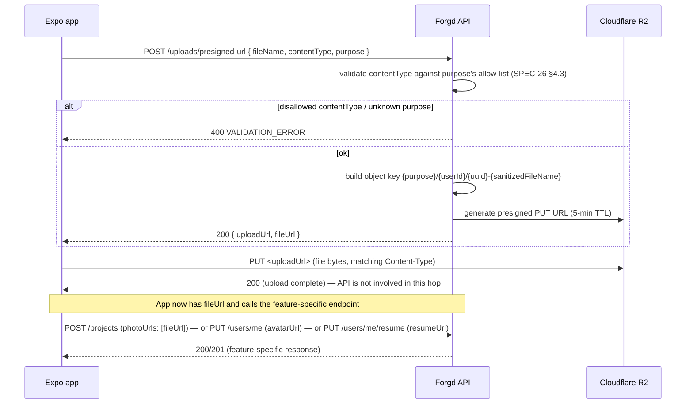

# File Upload Flow

The shared presigned-upload sequence used by project photos/pdfs (SPEC-06), avatar (SPEC-21), and resume (SPEC-22). Documented once here; each feature spec just references this and shows how it stores the resulting `fileUrl`.

## Presigned upload (App ↔ API ↔ R2)

## Notes

- The API is only in the loop for the first and last hop — the actual file bytes never pass through the Fastify server, only through R2 directly. This keeps the API stateless and avoids buffering large files in memory.
- If the presigned URL expires before the App uploads (rare — 5 minutes is generous for a mobile upload), R2 rejects the `PUT` directly. The App's recovery path is simply to request a new presigned URL and retry — no special error code from the API to handle here, since the API was never told the upload failed.
- Every consumer (SPEC-06, SPEC-21, SPEC-22) treats `fileUrl` as an opaque already-uploaded reference — none of them re-validate that the file actually exists in R2 before saving the reference. A submitted `fileUrl` that doesn't correspond to a real object is a self-inflicted edge case (the user would just see a broken image/PDF), not something the API guards against in V1.
