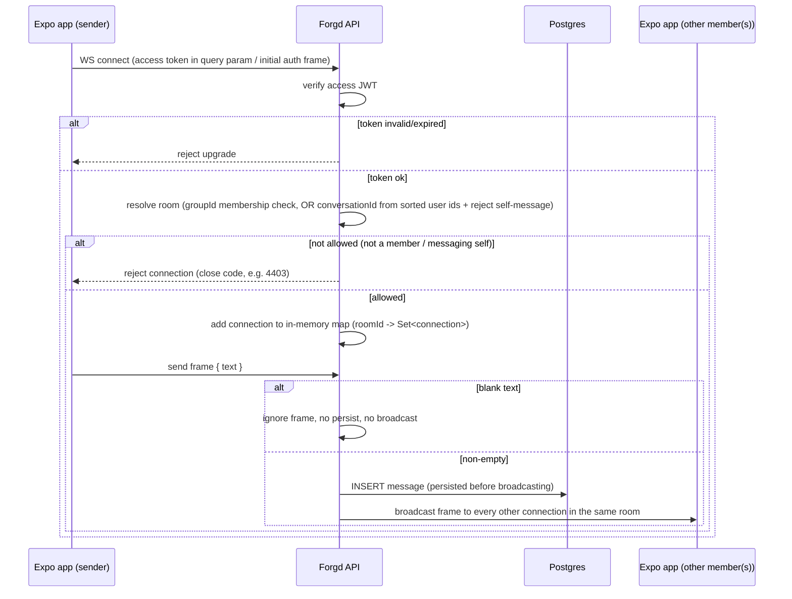
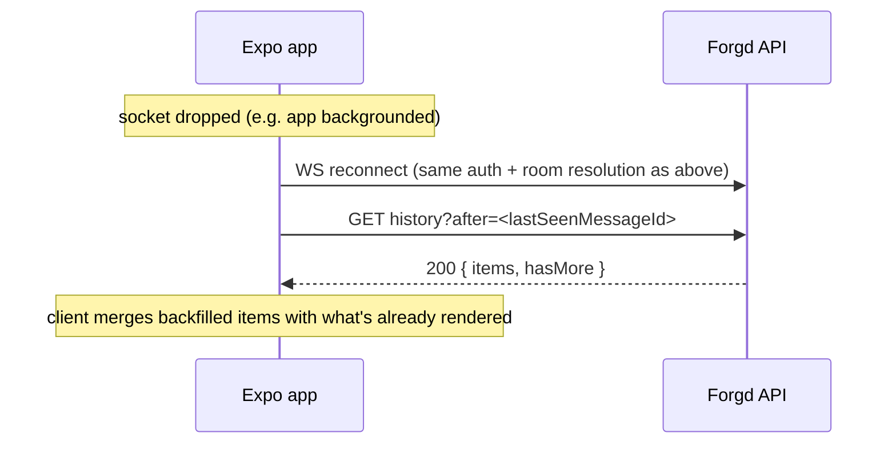

# Realtime Connection Flow (WebSocket)

The shared WebSocket connection pattern used by Group Chat (SPEC-17) and Direct Messages (SPEC-25). Same `@fastify/websocket` connection-map approach in both — Group Chat keys by `groupId`, DMs key by `conversationId` (derived deterministically from the sorted pair of user ids). Documented once here; each spec's own §3/§4 covers what's specific to it (membership check vs. self-message check, `groupId` vs `conversationId`).

## Connect, send, broadcast

## Reconnect / backfill

## Notes

- Persistence always happens before broadcast (never fire-and-forget) — chat history must survive a reconnect or a server restart, per both SPEC-17 and SPEC-25's Implementation Notes.
- The connection map is in-memory, single Fastify process (fine at V1 scale — see SPEC-17 §6). No Redis pub/sub, no dedicated realtime service. If Forgd ever runs multiple API instances, this whole flow needs revisiting — flagged as the same kind of risk as the Vercel/WebSocket note in `CONTEXT.md`.
- The server does **not** replay missed messages automatically on reconnect — that's the client's job, via the `after`/`before` cursor on the REST history endpoint. Keep that logic client-side and simple (SPEC-17 §3.3).
